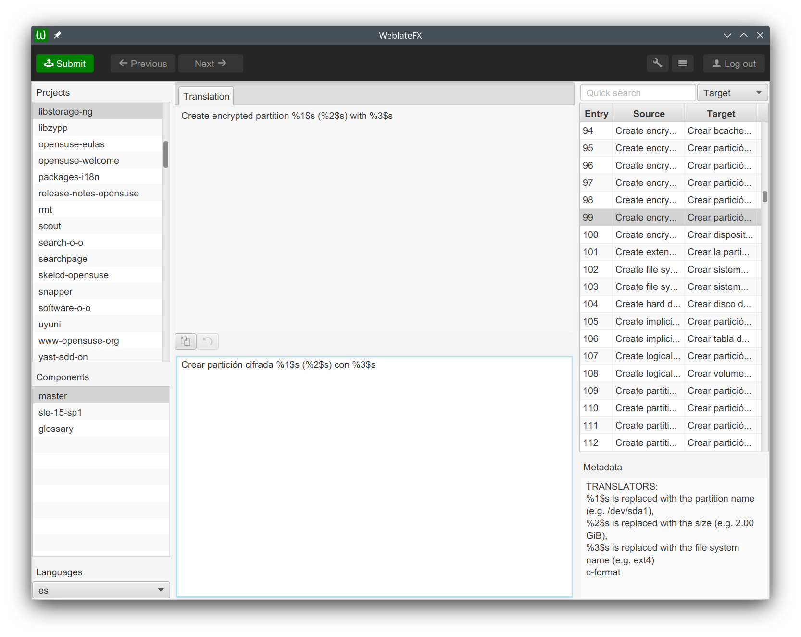

# wlfx
WLFX is a JavaFX-based Weblate client

Dependencies
------------
* JavaFX 11+
* jwl (from https://github.com/javierllorente/jwl)
* jgettext (from https://github.com/javierllorente/jgettext)
* ikonli-javafx
* ikonli-icomoon-pack
* java-diff-utils

Build & Run with Maven
------------
`mvn javafx:run`

Keyboard shortcuts
------------
| Task        | Shortcut    |
| ----------- | ----------- |
| Quick access to projects | Ctrl + 1 |
| Quick access to components | Ctrl + 2 | 
| Quick access to languages | Ctrl + 3 |
| Previous entry | Ctrl + , |
| Next entry | Ctrl + . |
| Quick search | Ctrl + F |
| Focus translation area | Ctrl + D |
| Switch tabs | Ctrl + T |
| Submit changes | Ctrl + S |
| Quit | Ctrl + Q |

Screenshot
------------

